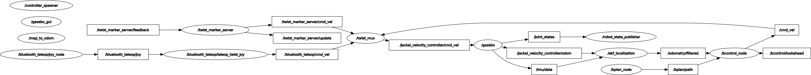

# Development Notes

This document is a collection of notes used during development.

## Tembo

Useful commands on the [tembo](https://cs.uwaterloo.ca/twiki/view/CF/Tembo) cluster:

```bash
# Install parallel
mkdir tmp
pushd tmp
wget http://ftp.gnu.org/gnu/parallel/parallel-latest.tar.bz2
tar xjf parallel-latest.tar.bz2
cd parallel-*
./configure --prefix=$HOME/benz/local/
make
make install
popd
echo 'will cite' | parallel --citation

pdsh -S -F ./tembo-genders.txt -g all -l $USER 'echo -e "MaxStartups 100:30:200\nMaxSessions 100" | sudo tee -a /etc/ssh/sshd_config'
pdsh -S -F ./tembo-genders.txt -g all -l $USER 'sudo systemctl restart sshd.service'

# Install parallel on all machines
pdsh -S -F ./tembo-genders.txt -g all -l $USER 'mkdir -p /tmp/parallel && cd /tmp/parallel && wget -q http://ftp.gnu.org/gnu/parallel/parallel-latest.tar.bz2 && tar xjf parallel-latest.tar.bz2 && rm parallel-latest.tar.bz2 && cd parallel-* && sudo ./configure && make && sudo make install && echo "will cite" | parallel --citation'

pdsh -S -F ./tembo-genders.txt -g all -l $USER 'cd ~/benz/research-jackal && ./bootstrap-tembo.sh'
pdsh -S -F ./tembo-genders.txt -g all -l $USER 'cd ~/benz/research-jackal && source /hdd2/.host_profile && docker compose up -d --build sim_headless'
pdsh -S -F ./tembo-genders.txt -g all -l $USER 'cd ~/benz/research-jackal && source /hdd2/.host_profile && docker compose exec sim_headless bash -c "source /etc/local.bashrc && devsetup && rosdep_install_all"'

# Copy the workspace to the container, do a clean build 
pdsh -S -F ./tembo-genders.txt -g all -l $USER 'cd ~/benz/research-jackal && source /hdd2/.host_profile && docker compose exec sim_headless bash -c "sudo rsync -a /workspace{_ro/catkin_ws,/.} && rm -rf build install logs && source /etc/local.bashrc && catkin build"'

# Run experiments
pdsh -S -F ./tembo-genders.txt -g all -l $USER 'cd ~/benz/research-jackal && source /hdd2/.host_profile && docker compose exec sim_headless bash -c "sudo rsync -a /workspace{_ro/catkin_ws,/.} && source /etc/local.bashrc && catkin build && ./scripts/run-scenario.sh myexp-$(hostname) ./scripts/scenario-playground.sh"'
```

## Other notes

`cmd_vel` is the topic for sending velocity commands to the robot. The message type is `geometry_msgs/Twist`.

`/opt/ros/noetic/share/jackal_control/launch/control.launch` launches the EKF when the `enable_ekf` parameter or the `ENABLE_EKF` environment variable is true. Defaults to true. `/opt/ros/noetic/share/jackal_control/config/robot_localization.yaml` is the configuration for the EKF.

A graph of nodes and topics (in simulation):



View the graph with `rosrun rqt_graph rqt_graph`.

View the tf tree with `rosrun rqt_tf_tree rqt_tf_tree`. Or `rosrun tf2_tools view_frames.py`.

### Converting ROS bags for visualization

We have a script to augment rosbags with useful information for visualization:

```bash
python ./data_postprocessing/rosbag-augmenter.py path_to_rosbag.bag
```

To batch process all rosbags in the experiments directory:

```bash
export SHOW_PROGRESS=false; find experiments/ -maxdepth 2 -name '*[!.augmented].bag' -print0 | xargs -n1 -0 -P8 -I {} python ./data_postprocessing/rosbag-augmenter.py --overwrite {}
```

To batch process unprocessed rosbags, remove the `--overwrite` flag.

### Serving ROS bags

```bash
npx 'https://github.com/ben-z/http-server#8aa6a8f' --cors='ETag,Content-Type,Accept-Ranges,Content-Length' -p 18090
```

I couldn't find an off-the-shelf 1-line solution that is compatible with the webviz remote bag CORS requirements. So I had to patch the `http-server` package to add `Access-Control-Expose-Headers` support. [Here's more information](https://github.com/cruise-automation/webviz/issues/247#issuecomment-1503808676).

### Robot

The configuration for the Jackal (startup scripts, etc.) is in /etc/ros.

The `jackal_control` package is the one in the home folder:
```bash
> rospack find jackal_control
/home/administrator/catkin_ws/src/jackal/jackal_control
```

### Sensors

The Jackal has the following sensors:
- IMU
- Odom (wheel encoder?)

Default `robot_localization` configuration found at `/opt/ros/noetic/share/jackal_control/config/robot_localization.yaml`:

```yaml
#Configuation for robot odometry EKF
#
frequency: 50

odom0: /jackal_velocity_controller/odom
odom0_config: [false, false, false, # x, y, z
               false, false, false, # roll, pitch, yaw
               true, true, true, # dx, dy, dz
               false, false, true, # droll, dpitch, dyaw
               false, false, false] # ddx, ddy, ddz
odom0_differential: false

imu0: /imu/data
imu0_config: [false, false, false,
              true, true, false,
              false, false, false,
              true, true, true,
              false, false, false]
imu0_differential: false

odom_frame: odom
base_link_frame: base_link
world_frame: odom

predict_to_current_time: true
```

### Time synchronization

The university appears to block accessing port 123 (NTP) from the university network. This causes the clock to be out of sync with the rest of the network. Below are some workarounds.

#### NTP

Run this on a host machine
```bash
sudo docker run --name=ntp --env=NTP_SERVERS="127.127.1.1" --rm --publish=123:123/udp cturra/ntp
```

Edit `/etc/systemd/timesyncd.conf` on the robot to include `NTP=<host_ip>`.

```bash
systemctl restart systemd-timesyncd # restart the time sync service
journalctl -u systemd-timesyncd -f # monitor the time sync service logs
```

##### Stratum 1 servers

[List here](https://www.advtimesync.com/docs/manual/stratum1.html)

Tested working at the time of writing:
```
ntp.student.cs.uwaterloo.ca
clock.uregina.ca
```


#### PTP

*ptp4l requires an interface that supports timestamping. Only the ethernet interface supports timestamping. Also, it didn't work on the robot when connecting the `eno1` to `wato-laptop1`'s enp4s0. So the instructions below are deprecated.*

We use `ptp4l` to synchronize the robot's clock with the master clock on the host machine.

```bash
sudo apt install linuxptp
ethtool -T <interface> # check if the interface supports hardware timestamping
ptp4l -i <interface> -m -S # -i is the interface to use, -m outputs messages to stdout, -S uses software timestamping
```

### Networking

#### Wireless card no-carrier

This happened on 2023-03-13 on Jackal2 in the robohub. The wireless card appears to be missing (no-carrier in `ip a`, link detected: no in `ethtool`) but shows up in `sudo lspci -vvv | grep -i -A 44 wireless` and `lshw -C network`.

I had to run `sudo modprobe -r iwlwifi && sudo modprobe iwlwifi` every time after startup now to recover the wifi connection.


### Running scenarios

```bash
./scripts/run-scenario.sh myexp ./scripts/scenario-playground.sh
python3 -m scripts.run_experiment empty
python3 -m scripts.run_experiment --gazebo_world empty corruption /global_localization/robot/odom/corruption nav_msgs/Odometry orientation step -1.0
```

### Injecting corruptions (new)

The `corruption_generator.py` script can be used to inject corruption into a topic. The script publishes a message to a topic that is subscribed to by a node that corrupts the topic.

```bash
python3 -m src.bcontrol.src.corruption_generator /global_localization/robot/odom/corruption nav_msgs/Odometry orientation step -1.0
python3 -m src.bcontrol.src.corruption_generator /global_localization/robot/odom/corruption nav_msgs/Odometry orientation oscillating 0.3 --period 15.0
python3 -m src.bcontrol.src.corruption_generator /global_localization/robot/odom/corruption nav_msgs/Odometry orientation ramp 0.5
python3 -m src.bcontrol.src.corruption_generator /jackal_velocity_controller/odom/corruption nav_msgs/Odometry linear_vel_x ramp 0.1
python3 -m src.bcontrol.src.corruption_generator /bbase/imu/data/corruption sensor_msgs/Imu angular_vel_z step 0.5
```

When shutting down, the node automatically publishes a message to the corruption topic to reset the corruption to 0.


### Injecting corruptions (old, deprecated)

Add to the yaw of the robot's odometry message ([angle converter](https://www.andre-gaschler.com/rotationconverter/)):

```bash
# -60 degs
rostopic pub /global_localization/robot/odom/corruption nav_msgs/Odometry "header:
  seq: 0
  stamp:
    secs: 0
    nsecs: 0
  frame_id: ''
child_frame_id: ''
pose:
  pose:
    position: {x: 0.0, y: 0.0, z: 0.0}
    orientation: {x: 0.0, y: 0.0, z: -0.5, w: 0.8660254 }
  covariance: [0.0, 0.0, 0.0, 0.0, 0.0, 0.0, 0.0, 0.0, 0.0, 0.0, 0.0, 0.0, 0.0, 0.0,
    0.0, 0.0, 0.0, 0.0, 0.0, 0.0, 0.0, 0.0, 0.0, 0.0, 0.0, 0.0, 0.0, 0.0, 0.0, 0.0,
    0.0, 0.0, 0.0, 0.0, 0.0, 0.0]
twist:
  twist:
    linear: {x: 0.0, y: 0.0, z: 0.0}
    angular: {x: 0.0, y: 0.0, z: 0.0}
  covariance: [0.0, 0.0, 0.0, 0.0, 0.0, 0.0, 0.0, 0.0, 0.0, 0.0, 0.0, 0.0, 0.0, 0.0,
    0.0, 0.0, 0.0, 0.0, 0.0, 0.0, 0.0, 0.0, 0.0, 0.0, 0.0, 0.0, 0.0, 0.0, 0.0, 0.0,
    0.0, 0.0, 0.0, 0.0, 0.0, 0.0]" 

# -30 degs
rostopic pub /global_localization/robot/odom/corruption nav_msgs/Odometry "header:
  seq: 0
  stamp:
    secs: 0
    nsecs: 0
  frame_id: ''
child_frame_id: ''
pose:
  pose:
    position: {x: 0.0, y: 0.0, z: 0.0}
    orientation: {x: 0.0, y: 0.0, z: -0.258819, w: 0.9659258 }
  covariance: [0.0, 0.0, 0.0, 0.0, 0.0, 0.0, 0.0, 0.0, 0.0, 0.0, 0.0, 0.0, 0.0, 0.0,
    0.0, 0.0, 0.0, 0.0, 0.0, 0.0, 0.0, 0.0, 0.0, 0.0, 0.0, 0.0, 0.0, 0.0, 0.0, 0.0,
    0.0, 0.0, 0.0, 0.0, 0.0, 0.0]
twist:
  twist:
    linear: {x: 0.0, y: 0.0, z: 0.0}
    angular: {x: 0.0, y: 0.0, z: 0.0}
  covariance: [0.0, 0.0, 0.0, 0.0, 0.0, 0.0, 0.0, 0.0, 0.0, 0.0, 0.0, 0.0, 0.0, 0.0,
    0.0, 0.0, 0.0, 0.0, 0.0, 0.0, 0.0, 0.0, 0.0, 0.0, 0.0, 0.0, 0.0, 0.0, 0.0, 0.0,
    0.0, 0.0, 0.0, 0.0, 0.0, 0.0]" 

# -15 degs
rostopic pub /global_localization/robot/odom/corruption nav_msgs/Odometry "header:
  seq: 0
  stamp:
    secs: 0
    nsecs: 0
  frame_id: ''
child_frame_id: ''
pose:
  pose:
    position: {x: 0.0, y: 0.0, z: 0.0}
    orientation: {x: 0.0, y: 0.0, z: -0.1305262, w: 0.9914449 }
  covariance: [0.0, 0.0, 0.0, 0.0, 0.0, 0.0, 0.0, 0.0, 0.0, 0.0, 0.0, 0.0, 0.0, 0.0,
    0.0, 0.0, 0.0, 0.0, 0.0, 0.0, 0.0, 0.0, 0.0, 0.0, 0.0, 0.0, 0.0, 0.0, 0.0, 0.0,
    0.0, 0.0, 0.0, 0.0, 0.0, 0.0]
twist:
  twist:
    linear: {x: 0.0, y: 0.0, z: 0.0}
    angular: {x: 0.0, y: 0.0, z: 0.0}
  covariance: [0.0, 0.0, 0.0, 0.0, 0.0, 0.0, 0.0, 0.0, 0.0, 0.0, 0.0, 0.0, 0.0, 0.0,
    0.0, 0.0, 0.0, 0.0, 0.0, 0.0, 0.0, 0.0, 0.0, 0.0, 0.0, 0.0, 0.0, 0.0, 0.0, 0.0,
    0.0, 0.0, 0.0, 0.0, 0.0, 0.0]" 

# -7.5 degs
rostopic pub /global_localization/robot/odom/corruption nav_msgs/Odometry "header:
  seq: 0
  stamp:
    secs: 0
    nsecs: 0
  frame_id: ''
child_frame_id: ''
pose:
  pose:
    position: {x: 0.0, y: 0.0, z: 0.0}
    orientation: {x: 0.0, y: 0.0, z: -0.0654031, w: 0.9978589 }
  covariance: [0.0, 0.0, 0.0, 0.0, 0.0, 0.0, 0.0, 0.0, 0.0, 0.0, 0.0, 0.0, 0.0, 0.0,
    0.0, 0.0, 0.0, 0.0, 0.0, 0.0, 0.0, 0.0, 0.0, 0.0, 0.0, 0.0, 0.0, 0.0, 0.0, 0.0,
    0.0, 0.0, 0.0, 0.0, 0.0, 0.0]
twist:
  twist:
    linear: {x: 0.0, y: 0.0, z: 0.0}
    angular: {x: 0.0, y: 0.0, z: 0.0}
  covariance: [0.0, 0.0, 0.0, 0.0, 0.0, 0.0, 0.0, 0.0, 0.0, 0.0, 0.0, 0.0, 0.0, 0.0,
    0.0, 0.0, 0.0, 0.0, 0.0, 0.0, 0.0, 0.0, 0.0, 0.0, 0.0, 0.0, 0.0, 0.0, 0.0, 0.0,
    0.0, 0.0, 0.0, 0.0, 0.0, 0.0]" 
```

Reset global odometry corruption:

```bash
rostopic pub /global_localization/robot/odom/corruption nav_msgs/Odometry "header:
  seq: 0
  stamp:
    secs: 0
    nsecs: 0
  frame_id: ''
child_frame_id: ''
pose:
  pose:
    position: {x: 0.0, y: 0.0, z: 0.0}
    orientation: {x: 0.0, y: 0.0, z: 0.0, w: 0.0}
  covariance: [0.0, 0.0, 0.0, 0.0, 0.0, 0.0, 0.0, 0.0, 0.0, 0.0, 0.0, 0.0, 0.0, 0.0,
    0.0, 0.0, 0.0, 0.0, 0.0, 0.0, 0.0, 0.0, 0.0, 0.0, 0.0, 0.0, 0.0, 0.0, 0.0, 0.0,
    0.0, 0.0, 0.0, 0.0, 0.0, 0.0]
twist:
  twist:
    linear: {x: 0.0, y: 0.0, z: 0.0}
    angular: {x: 0.0, y: 0.0, z: 0.0}
  covariance: [0.0, 0.0, 0.0, 0.0, 0.0, 0.0, 0.0, 0.0, 0.0, 0.0, 0.0, 0.0, 0.0, 0.0,
    0.0, 0.0, 0.0, 0.0, 0.0, 0.0, 0.0, 0.0, 0.0, 0.0, 0.0, 0.0, 0.0, 0.0, 0.0, 0.0,
    0.0, 0.0, 0.0, 0.0, 0.0, 0.0]" 
```

Make the robot think it is moving 0.4m/s faster than it actually is:

```bash
rostopic pub /jackal_velocity_controller/odom/corruption nav_msgs/Odometry "header:
  seq: 0
  stamp:
    secs: 0
    nsecs: 0
  frame_id: ''
child_frame_id: ''
pose:
  pose:
    position: {x: 0.0, y: 0.0, z: 0.0}
    orientation: {x: 0.0, y: 0.0, z: 0.0, w: 0.0}
  covariance: [0.0, 0.0, 0.0, 0.0, 0.0, 0.0, 0.0, 0.0, 0.0, 0.0, 0.0, 0.0, 0.0, 0.0,
    0.0, 0.0, 0.0, 0.0, 0.0, 0.0, 0.0, 0.0, 0.0, 0.0, 0.0, 0.0, 0.0, 0.0, 0.0, 0.0,
    0.0, 0.0, 0.0, 0.0, 0.0, 0.0]
twist:
  twist:
    linear: {x: 0.4, y: 0.0, z: 0.0}
    angular: {x: 0.0, y: 0.0, z: 0.0}
  covariance: [0.0, 0.0, 0.0, 0.0, 0.0, 0.0, 0.0, 0.0, 0.0, 0.0, 0.0, 0.0, 0.0, 0.0,
    0.0, 0.0, 0.0, 0.0, 0.0, 0.0, 0.0, 0.0, 0.0, 0.0, 0.0, 0.0, 0.0, 0.0, 0.0, 0.0,
    0.0, 0.0, 0.0, 0.0, 0.0, 0.0]" 
```

Make the robot think it's turning -0.4rad/s faster than it actually is:

```bash
rostopic pub /jackal_velocity_controller/odom/corruption nav_msgs/Odometry "header:
  seq: 0
  stamp:
    secs: 0
    nsecs: 0
  frame_id: ''
child_frame_id: ''
pose:
  pose:
    position: {x: 0.0, y: 0.0, z: 0.0}
    orientation: {x: 0.0, y: 0.0, z: 0.0, w: 0.0}
  covariance: [0.0, 0.0, 0.0, 0.0, 0.0, 0.0, 0.0, 0.0, 0.0, 0.0, 0.0, 0.0, 0.0, 0.0,
    0.0, 0.0, 0.0, 0.0, 0.0, 0.0, 0.0, 0.0, 0.0, 0.0, 0.0, 0.0, 0.0, 0.0, 0.0, 0.0,
    0.0, 0.0, 0.0, 0.0, 0.0, 0.0]
twist:
  twist:
    linear: {x: 0.0, y: 0.0, z: 0.0}
    angular: {x: 0.0, y: 0.0, z: -0.4}
  covariance: [0.0, 0.0, 0.0, 0.0, 0.0, 0.0, 0.0, 0.0, 0.0, 0.0, 0.0, 0.0, 0.0, 0.0,
    0.0, 0.0, 0.0, 0.0, 0.0, 0.0, 0.0, 0.0, 0.0, 0.0, 0.0, 0.0, 0.0, 0.0, 0.0, 0.0,
    0.0, 0.0, 0.0, 0.0, 0.0, 0.0]" 
```

Reset local odometry corruption:

```bash
rostopic pub /jackal_velocity_controller/odom/corruption nav_msgs/Odometry "header:
  seq: 0
  stamp:
    secs: 0
    nsecs: 0
  frame_id: ''
child_frame_id: ''
pose:
  pose:
    position: {x: 0.0, y: 0.0, z: 0.0}
    orientation: {x: 0.0, y: 0.0, z: 0.0, w: 0.0}
  covariance: [0.0, 0.0, 0.0, 0.0, 0.0, 0.0, 0.0, 0.0, 0.0, 0.0, 0.0, 0.0, 0.0, 0.0,
    0.0, 0.0, 0.0, 0.0, 0.0, 0.0, 0.0, 0.0, 0.0, 0.0, 0.0, 0.0, 0.0, 0.0, 0.0, 0.0,
    0.0, 0.0, 0.0, 0.0, 0.0, 0.0]
twist:
  twist:
    linear: {x: 0.0, y: 0.0, z: 0.0}
    angular: {x: 0.0, y: 0.0, z: 0.0}
  covariance: [0.0, 0.0, 0.0, 0.0, 0.0, 0.0, 0.0, 0.0, 0.0, 0.0, 0.0, 0.0, 0.0, 0.0,
    0.0, 0.0, 0.0, 0.0, 0.0, 0.0, 0.0, 0.0, 0.0, 0.0, 0.0, 0.0, 0.0, 0.0, 0.0, 0.0,
    0.0, 0.0, 0.0, 0.0, 0.0, 0.0]" 
```

Corrupt the IMU:

```bash
rostopic pub /bbase/imu/data/corruption sensor_msgs/Imu "header:
  seq: 0
  stamp: {secs: 0, nsecs: 0}
  frame_id: ''
orientation: {x: 0.0, y: 0.0, z: 0.0, w: 0.0}
orientation_covariance: [0.0, 0.0, 0.0, 0.0, 0.0, 0.0, 0.0, 0.0, 0.0]
angular_velocity: {x: 0.0, y: 0.0, z: -0.5}
angular_velocity_covariance: [0.0, 0.0, 0.0, 0.0, 0.0, 0.0, 0.0, 0.0, 0.0]
linear_acceleration: {x: 0.0, y: 0.0, z: 0.0}
linear_acceleration_covariance: [0.0, 0.0, 0.0, 0.0, 0.0, 0.0, 0.0, 0.0, 0.0]"
```

Restore the IMU:

```bash
rostopic pub /bbase/imu/data/corruption sensor_msgs/Imu "header:
  seq: 0
  stamp: {secs: 0, nsecs: 0}
  frame_id: ''
orientation: {x: 0.0, y: 0.0, z: 0.0, w: 0.0}
orientation_covariance: [0.0, 0.0, 0.0, 0.0, 0.0, 0.0, 0.0, 0.0, 0.0]
angular_velocity: {x: 0.0, y: 0.0, z: 0.0}
angular_velocity_covariance: [0.0, 0.0, 0.0, 0.0, 0.0, 0.0, 0.0, 0.0, 0.0]
linear_acceleration: {x: 0.0, y: 0.0, z: 0.0}
linear_acceleration_covariance: [0.0, 0.0, 0.0, 0.0, 0.0, 0.0, 0.0, 0.0, 0.0]"
```

Manually set the sensor validity:
  
```bash
rostopic pub /message_barrier/sensor_validity_input bcontrol/SensorValidity "data: [1,1,1,1,1,1]"
```

View the current sensor validity:

```bash
rostopic echo /sensor_barrier/sensor_validity_final
```


## Recording notes

2023-03-27 Video Recording (closed loop)
- Attack IMU angvel, successfully detected and handled
- Attack wheel odom angvel, successfully detected and handled
- Attack velocity, successfully detected and handled
- Attack heading (-60deg), successfully detected and handled
- Attack heading (-30deg), didn't detect
- Attack heading (-30deg), successfully detected and handled
- Attack heading (-15deg), didn't detect, then falsely detected IMU angvel corruption
- Attack heading (-15deg), didn't detect. Falsely detected IMU angvel corruption after stopping the attack.
- Attack heading (-15deg), didn't detect.
- Attack heading (-7.5deg), didn't detect, then falsely detected wheel odom angvel corruption, then falsely detected IMU angvel corruption


2023-03-27 Video Recording (open loop)
- Attack IMU angvel, successfully detected
- Attack wheel odom angvel, successfully detected, though there's no obvious behaviour change. Are we not fusing the wheel odom properly?
- Attack velocity, successfully detected
- Attack heading (-60deg), didn't detect
- Attack heading (-60deg), successfully detected
- Attack heading (-30deg), didn't detect
- Attack heading (-30deg), successfully detected
- Attack heading (-15deg), didn't detect, then falsely detected IMU angvel corruption
- Attack heading (-15deg), successfully detected, then falsely detected IMU angvel corruption. This is open loop so it's probably due to the unhandled corruption.
- Attack heading (-7.5deg), didn't detect, then falsely detected IMU angvel corruption and (x corruption?). When stopping the attack, it falsely detected wheel odom velocity corruption.
