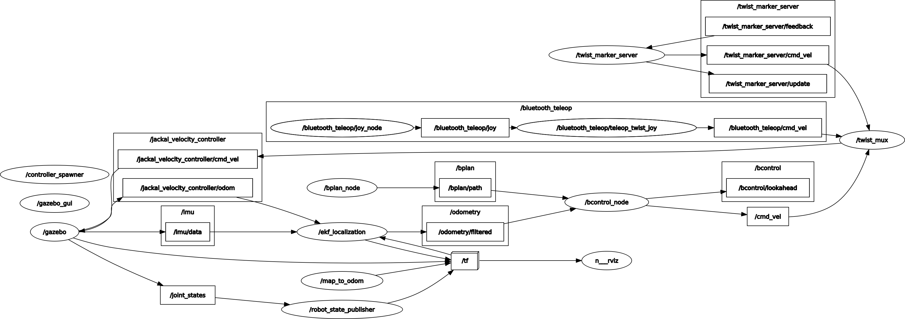

# Jackal Research

There are a few components in this project. They include:
1. `robot.launch`: Launches the basic services required for the robot to operate. This includes positioning services, transform publishers, etc.
1. `sim.launch`: Same as `robot.launch`, but for simulation.
1. `stack.launch`: Launches our custom stack. This includes the controller, the planner, the localiser, the detector, etc.
1. `visualization.launch`: Launches visualization nodes. Requires a display.

We can run the stack in the following configurations in the real world:
| `robot.launch` | `stack.launch` | `visualization.launch` | Comments |
| --- | --- | --- | --- |
| Robot | Robot | Workstation | The ideal setup. Pretty much every thing runs on the robot, we use the workstation for monitoring only. |
| Workstation | Workstation | Workstation | This is used for debugging or when the robot has insufficient resources. |


## Workspace setup

Please use `Dockerfile` as the source of truth for required packages. The following instructions are for quick reference only.

### ROS

1. Install ROS Noetic.
1. Install catkin_tools: `pip install catkin_tools`
1. Install Jackal packages: `sudo apt install ros-noetic-jackal-*`

### Development tools

```bash
sudo apt install -y \
    grepcidr \ # CIDR range matching (for use with scripts that automatically connect to robots)
    ripgrep
```

## Robot setup

### Jackal2 Configuration

`ben_jackal2.vsk`: VICON configuration for the Jackal2 object. This contains 3 markers around the body and 3 markers surrounding the IMU unit.

### Connecting the controller to the robot

Put the controller in pairing mode. On the controller, press the PS button and the Share button at the same time. The controller will start flashing.

```bash
sudo bluetoothctl
scan on
# wait for the controller to show up
scan off
pair <controller-mac-address> # connect to the controller
trust <controller-mac-address> # trust the controller
connect <controller-mac-address> # connect to the controller
```

Troubleshooting tips:
- https://superuser.com/a/1199595/465482

### Connecting rviz to the robot

```bash
source /opt/ros/noetic/setup.sh
export ROS_MASTER_URI=http://jackal1.robohub.eng.uwaterloo.ca:11311
```

### Recording rosbags on the robot

```bash
# SSH into the robot
ssh jackal1

# Record. -j enables compression, -a records all topics,
# -o adds a prefix to the file name
rosbag record -j -a -o <recording-prefix>
```

## Development on the robot

Visualizations:

```bash
ros_connect_to_jackal2 # shortcut defined in ~/.commonrc (version controlled in personal dotfiles repo)
cd ~/Projects/research-jackal/catkin_ws
rosdep install --from-paths src --ignore-src -r -y
catkin build
source ./devel/setup.zsh
DISPLAY=:0 roslaunch bcontrol visualization.launch
```

Running the stack on the robot:

```bash
ros-stop # Stop the default stack. We have our own end-to-end stack.
docker compose up -d --build robot
docker compose exec robot bash
devsetup
rosdep_install_all
catkin build
source ./devel/setup.bash
ENABLE_EKF=false roslaunch bcontrol robot.launch
roslaunch bcontrol stack.launch platform:=robot enable_detector:=false
roslaunch bcontrol detector.launch platform:=robot # or
roslaunch bcontrol detector.launch platform:=robot debug:=true # for interactive debugging
rosrun bcontrol solver_server.py # or
rosrun bcontrol solver_server_debug.py # for interactive debugging
```

Note that by default, only 1 interactive debugging node can be run at a time. To run multiple interactive debugging nodes, we need to change the hard-coded port number in the corresponding debug files.

## Simulation

Start the Docker container:

```bash
./generate-dot-env.sh
docker compose up -d --build
docker compose exec sim bash
```

All commands from now on should be run inside the container.

cd into the catkin workspace:

```bash
devsetup # shortcut for cd-ing into the catkin_ws dir and sourcing setup.bash (defined in /etc/local.bashrc)
```

Install dependencies:

```bash
rosdep_install_all # shortcut (defined in /etc/local.bashrc)
```

Build the workspace:

```bash
catkin build
```

Start the simulation and the stack:

```bash
# Launch the simulation
VGL_DISPLAY=egl0 DISPLAY=:1.0 ENABLE_EKF=false vglrun roslaunch bcontrol sim.launch
# Launch visualizations
VGL_DISPLAY=egl0 DISPLAY=:1.0 vglrun roslaunch bcontrol visualization.launch
# Launch the stack
roslaunch bcontrol stack.launch platform:=sim
# Or launch the stack and detector separately
roslaunch bcontrol stack.launch platform:=sim enable_detector:=false
roslaunch bcontrol detector.launch platform:=sim # or
roslaunch bcontrol detector.launch platform:=sim debug:=true # for interactive debugging
rosrun bcontrol solver_server.py # or
rosrun bcontrol solver_server_debug.py # for interactive debugging
```

Note that by default, only 1 interactive debugging node can be run at a time. To run multiple interactive debugging nodes, we need to change the hard-coded port number in the corresponding debug files.

`VGL_DISPLAY=egl0` is used to tell VirtualGL to use the first EGL device. Each EGL device corresponds to a `/dev/dri/card*` device.

Useful VGL commands:

```bash
sudo /opt/VirtualGL/bin/eglinfo -e # list available EGL devices
```

## Development notes

`cmd_vel` is the topic for sending velocity commands to the robot. The message type is `geometry_msgs/Twist`.

`/opt/ros/noetic/share/jackal_control/launch/control.launch` launches the EKF when the `enable_ekf` parameter or the `ENABLE_EKF` environment variable is true. Defaults to true. `/opt/ros/noetic/share/jackal_control/config/robot_localization.yaml` is the configuration for the EKF.

A graph of nodes and topics (in simulation):



View the graph with `rosrun rqt_graph rqt_graph`.

View the tf tree with `rosrun rqt_tf_tree rqt_tf_tree`. Or `rosrun tf2_tools view_frames.py`.

### Robot

The configuration for the Jackal (startup scripts, etc.) is in /etc/ros.

The `jackal_control` package is the one in the home folder:
```bash
> rospack find jackal_control
/home/administrator/catkin_ws/src/jackal/jackal_control
```

### Sensors

The Jackal has the following sensors:
- IMU
- Odom (wheel encoder?)

Default `robot_localization` configuration found at `/opt/ros/noetic/share/jackal_control/config/robot_localization.yaml`:

```yaml
#Configuation for robot odometry EKF
#
frequency: 50

odom0: /jackal_velocity_controller/odom
odom0_config: [false, false, false, # x, y, z
               false, false, false, # roll, pitch, yaw
               true, true, true, # dx, dy, dz
               false, false, true, # droll, dpitch, dyaw
               false, false, false] # ddx, ddy, ddz
odom0_differential: false

imu0: /imu/data
imu0_config: [false, false, false,
              true, true, false,
              false, false, false,
              true, true, true,
              false, false, false]
imu0_differential: false

odom_frame: odom
base_link_frame: base_link
world_frame: odom

predict_to_current_time: true
```

### Time synchronization

The university appears to block accessing port 123 (NTP) from the university network. This causes the clock to be out of sync with the rest of the network. Below are some workarounds.

#### NTP

Run this on a host machine
```bash
sudo docker run --name=ntp --env=NTP_SERVERS="127.127.1.1" --rm --publish=123:123/udp cturra/ntp
```

Edit `/etc/systemd/timesyncd.conf` on the robot to include `NTP=<host_ip>`.

```bash
systemctl restart systemd-timesyncd # restart the time sync service
journalctl -u systemd-timesyncd -f # monitor the time sync service logs
```

##### Stratum 1 servers

[List here](https://www.advtimesync.com/docs/manual/stratum1.html)

Tested working at the time of writing:
```
ntp.student.cs.uwaterloo.ca
clock.uregina.ca
```


#### PTP

*ptp4l requires an interface that supports timestamping. Only the ethernet interface supports timestamping. Also, it didn't work on the robot when connecting the `eno1` to `wato-laptop1`'s enp4s0. So the instructions below are deprecated.*

We use `ptp4l` to synchronize the robot's clock with the master clock on the host machine.

```bash
sudo apt install linuxptp
ethtool -T <interface> # check if the interface supports hardware timestamping
ptp4l -i <interface> -m -S # -i is the interface to use, -m outputs messages to stdout, -S uses software timestamping
```

#### Wireless card no-carrier

This happened on 2023-03-13 on Jackal2 in the robohub. The wireless card appears to be missing (no-carrier in `ip a`, link detected: no in `ethtool`) but shows up in `sudo lspci -vvv | grep -i -A 44 wireless` and `lshw -C network`.

I had to run `sudo modprobe -r iwlwifi && sudo modprobe iwlwifi` every time after startup now to recover the wifi connection.

#### Corruption message examples

Add 0.5 radians to the yaw of the robot's odometry message ([angle converter](https://www.andre-gaschler.com/rotationconverter/)):

```bash
rostopic pub /global_localization/robot/odom/corruption nav_msgs/Odometry "header:
  seq: 0
  stamp:
    secs: 0
    nsecs: 0
  frame_id: ''
child_frame_id: ''
pose:
  pose:
    position: {x: 0.0, y: 0.0, z: 0.0}
    orientation: {x: 0.0, y: 0.0, z: 0.247404, w: 0.9689124}
  covariance: [0.0, 0.0, 0.0, 0.0, 0.0, 0.0, 0.0, 0.0, 0.0, 0.0, 0.0, 0.0, 0.0, 0.0,
    0.0, 0.0, 0.0, 0.0, 0.0, 0.0, 0.0, 0.0, 0.0, 0.0, 0.0, 0.0, 0.0, 0.0, 0.0, 0.0,
    0.0, 0.0, 0.0, 0.0, 0.0, 0.0]
twist:
  twist:
    linear: {x: 0.0, y: 0.0, z: 0.0}
    angular: {x: 0.0, y: 0.0, z: 0.0}
  covariance: [0.0, 0.0, 0.0, 0.0, 0.0, 0.0, 0.0, 0.0, 0.0, 0.0, 0.0, 0.0, 0.0, 0.0,
    0.0, 0.0, 0.0, 0.0, 0.0, 0.0, 0.0, 0.0, 0.0, 0.0, 0.0, 0.0, 0.0, 0.0, 0.0, 0.0,
    0.0, 0.0, 0.0, 0.0, 0.0, 0.0]" 
```

Reset global odometry corruption:

```bash
rostopic pub /global_localization/robot/odom/corruption nav_msgs/Odometry "header:
  seq: 0
  stamp:
    secs: 0
    nsecs: 0
  frame_id: ''
child_frame_id: ''
pose:
  pose:
    position: {x: 0.0, y: 0.0, z: 0.0}
    orientation: {x: 0.0, y: 0.0, z: 0.0, w: 0.0}
  covariance: [0.0, 0.0, 0.0, 0.0, 0.0, 0.0, 0.0, 0.0, 0.0, 0.0, 0.0, 0.0, 0.0, 0.0,
    0.0, 0.0, 0.0, 0.0, 0.0, 0.0, 0.0, 0.0, 0.0, 0.0, 0.0, 0.0, 0.0, 0.0, 0.0, 0.0,
    0.0, 0.0, 0.0, 0.0, 0.0, 0.0]
twist:
  twist:
    linear: {x: 0.0, y: 0.0, z: 0.0}
    angular: {x: 0.0, y: 0.0, z: 0.0}
  covariance: [0.0, 0.0, 0.0, 0.0, 0.0, 0.0, 0.0, 0.0, 0.0, 0.0, 0.0, 0.0, 0.0, 0.0,
    0.0, 0.0, 0.0, 0.0, 0.0, 0.0, 0.0, 0.0, 0.0, 0.0, 0.0, 0.0, 0.0, 0.0, 0.0, 0.0,
    0.0, 0.0, 0.0, 0.0, 0.0, 0.0]" 
```

Make the robot think it is moving 2m/s slower than it actually is:

```bash
rostopic pub /jackal_velocity_controller/odom/corruption nav_msgs/Odometry "header:
  seq: 0
  stamp:
    secs: 0
    nsecs: 0
  frame_id: ''
child_frame_id: ''
pose:
  pose:
    position: {x: 0.0, y: 0.0, z: 0.0}
    orientation: {x: 0.0, y: 0.0, z: 0.0, w: 0.0}
  covariance: [0.0, 0.0, 0.0, 0.0, 0.0, 0.0, 0.0, 0.0, 0.0, 0.0, 0.0, 0.0, 0.0, 0.0,
    0.0, 0.0, 0.0, 0.0, 0.0, 0.0, 0.0, 0.0, 0.0, 0.0, 0.0, 0.0, 0.0, 0.0, 0.0, 0.0,
    0.0, 0.0, 0.0, 0.0, 0.0, 0.0]
twist:
  twist:
    linear: {x: -0.2, y: 0.0, z: 0.0}
    angular: {x: 0.0, y: 0.0, z: 0.0}
  covariance: [0.0, 0.0, 0.0, 0.0, 0.0, 0.0, 0.0, 0.0, 0.0, 0.0, 0.0, 0.0, 0.0, 0.0,
    0.0, 0.0, 0.0, 0.0, 0.0, 0.0, 0.0, 0.0, 0.0, 0.0, 0.0, 0.0, 0.0, 0.0, 0.0, 0.0,
    0.0, 0.0, 0.0, 0.0, 0.0, 0.0]" 
```

Reset local odometry corruption:

```bash
rostopic pub /jackal_velocity_controller/odom/corruption nav_msgs/Odometry "header:
  seq: 0
  stamp:
    secs: 0
    nsecs: 0
  frame_id: ''
child_frame_id: ''
pose:
  pose:
    position: {x: 0.0, y: 0.0, z: 0.0}
    orientation: {x: 0.0, y: 0.0, z: 0.0, w: 0.0}
  covariance: [0.0, 0.0, 0.0, 0.0, 0.0, 0.0, 0.0, 0.0, 0.0, 0.0, 0.0, 0.0, 0.0, 0.0,
    0.0, 0.0, 0.0, 0.0, 0.0, 0.0, 0.0, 0.0, 0.0, 0.0, 0.0, 0.0, 0.0, 0.0, 0.0, 0.0,
    0.0, 0.0, 0.0, 0.0, 0.0, 0.0]
twist:
  twist:
    linear: {x: 0.0, y: 0.0, z: 0.0}
    angular: {x: 0.0, y: 0.0, z: 0.0}
  covariance: [0.0, 0.0, 0.0, 0.0, 0.0, 0.0, 0.0, 0.0, 0.0, 0.0, 0.0, 0.0, 0.0, 0.0,
    0.0, 0.0, 0.0, 0.0, 0.0, 0.0, 0.0, 0.0, 0.0, 0.0, 0.0, 0.0, 0.0, 0.0, 0.0, 0.0,
    0.0, 0.0, 0.0, 0.0, 0.0, 0.0]" 
```

Manually publish to `/bdetect/sensor_validity`:
  
```bash
rostopic pub /bdetect/sensor_validity std_msgs/UInt8MultiArray "data: [1,1,1,1,1,1]"
```

View the current sensor validity:

```bash
rostopic echo /corruption_passthrough/sensor_validity_final
```

